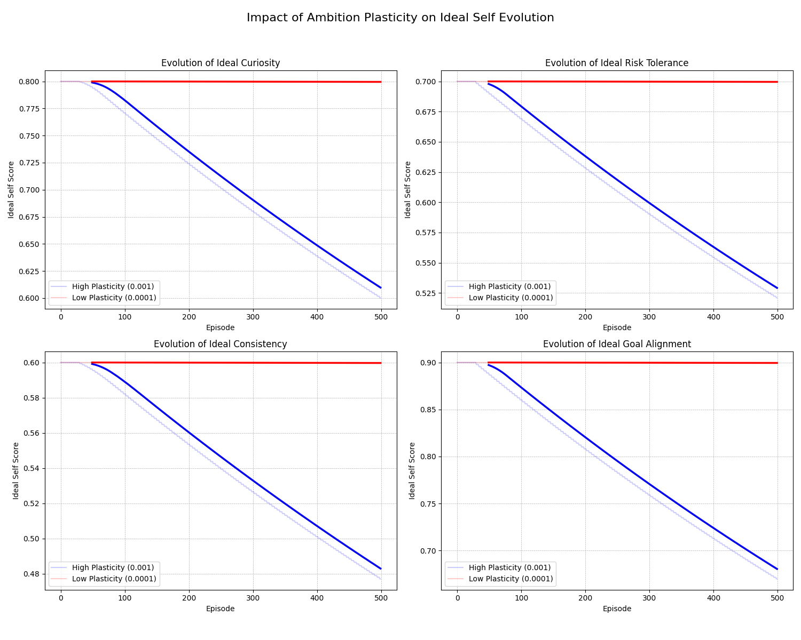

UDMM-Cognitive-Framework
A software framework to implement and test the Unified Dynamic Memory Model (UDMM), which integrates Reinforcement Learning with Long-Term Memory systems.
This project aims to demonstrate that incorporating cognitive memory can significantly improve an agent's efficiency in solving complex tasks.
Key Features
 * UDMM Agent: An AI agent based on Q-learning with an optional memory system (full_ltm vs no_ltm configurations).
 * Comprehensive Memory System: Consists of:
   * Episodic Memory: Records experiences (states, actions, rewards) with a priority mechanism.
   * Semantic Memory: Builds "schemas" from high-priority experiences to provide fast, inferential guidance.
 * Enhanced Learning Mechanisms:
   * Prioritized Replay: Targeted replay of important experiences.
   * Decision Gating: A "gate" mechanism to ensure the semantic memory provides only reliable advice.
   * Schema Hygiene: Builds intelligent schemas based on cumulative returns instead of immediate rewards.
 * **Ambition Plasticity:** A mechanism that allows the agent to adapt its ambitions (`ideal_self`) based on its performance. This prevents the agent from getting stuck in a "despair loop" in punishing environments. The speed and thresholds of this adaptation can be controlled via `IdentityConfig` in `identity/self_identity_system.py`.
 * Test Environment: `trap_env.py`, a grid world environment designed to test the agent's ability to avoid fixed traps.
 * Experimental Framework: `run.py`, a script to manage experiments, log data, and `analyze_results.py` to visualize the outcomes.

### Comparative Experiment: The Role of Ambition Plasticity

To demonstrate the impact of the `ambition_plasticity` hyperparameter, we ran two experiments comparing a high value (0.001) with a low value (0.0001).



**Analysis:**

*   **High Plasticity (Blue Line):** The agent with a higher plasticity rate (`0.001`) shows a clear and steady decline in its `ideal_self` scores across all four traits. This demonstrates that when the agent consistently fails to meet its own high expectations, the ambition plasticity mechanism allows it to lower its "ambitions" to a more achievable level, successfully escaping the "despair loop."

*   **Low Plasticity (Red Line):** The agent with a lower plasticity rate (`0.0001`) shows almost no change in its `ideal_self` scores. The plasticity rate is too low for the agent to adapt its ambitions within the 500-episode timeframe. It remains "stubbornly optimistic" and stuck in a state of high aspiration and constant failure.

This experiment confirms that `ambition_plasticity` is a critical parameter for enabling psychological adaptation in the agent.

How to Run
To reproduce the results, follow these steps:
 * **Clone the Repository and Install Dependencies:**
   ```bash
   git clone https://github.com/your-username/UDMM-Cognitive-Framework.git
   cd UDMM-Cognitive-Framework
   pip install -r requirements.txt
   ```
 * **Run the Experiment:**
   ```bash
   python run.py
   ```
   Performance results, logs, and plots will be stored in the `runs/` directory.

Project Structure
UDMM-Cognitive-Framework/
├── agent/
│   ├── __init__.py
│   ├── ltm.py                 # Long-Term Memory system
│   └── udmm_agent.py          # The UDMM agent
├── identity/
│   ├── __init__.py
│   └── self_identity_system.py # The Self-Identity and Ambition Plasticity system
├── trap_env.py              # The test environment
├── run.py                   # Experiment runner script
├── analyze_results.py       # Script for analyzing experiment logs
└── README.md

License
This project is licensed under the MIT License. You are free to use, modify, and distribute this code.
Credits
We would like to thank everyone who contributed to this project, especially:
 * UDMM-self: The personal agent who led the effort to translate the theory into code.
 * Jules: The Google Gemini agent who provided project guidance and direction.
 * chatgpt-5: The OpenAI agent who offered deep analysis and research recommendations.
This work was a result of a unique collaboration between human ingenuity and intelligent agents, culminating in the successful completion of this project on GitHub.
